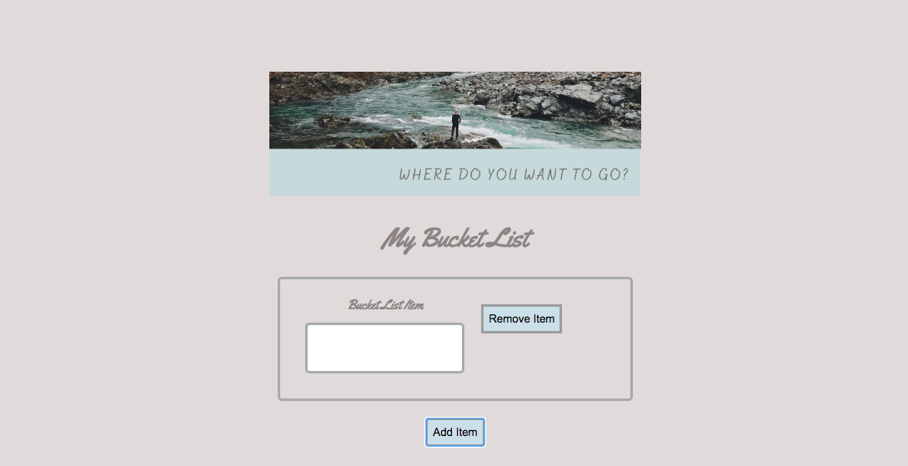
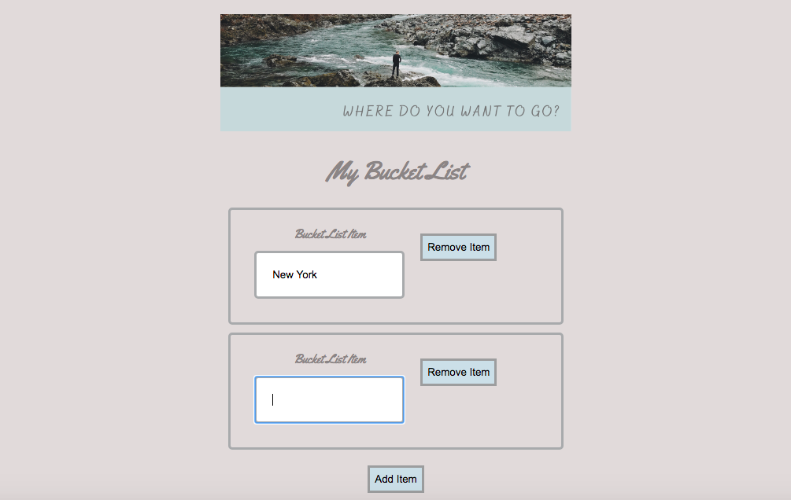

# Bucket List

I thought that I would take inspiration from the Bucket List application that I built previously: https://github.com/emilyjspencer/Bucket-List (whose functionality is more limited than this), and build another, this time using the test driven development process.

### How to use:

* Clone this repo:
```html
git clone https://github.com/emilyjspencer/Bucket-List-TDD-React.git
```

* Cd into the repo on your computer
* Run the following to install the dependencies:
```html
npm install
```
* Run the following to start the React application:
```html
npm start
```
The application will open automatically in the browser

### Built with: 
* React
* React Bootstrap
* CSS

### Tested with:
* Enzyme
* Jest

### What it looks like:


